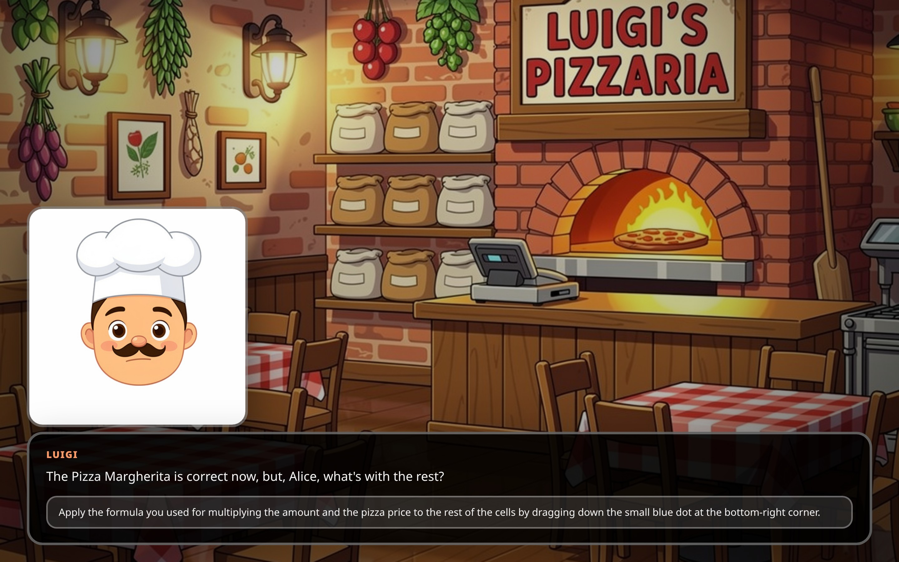

# CSCape Escape Rooms Marketplace

## Google Spreadsheet: Luigi's Missing Pizza Order

**Subject:** Computer Science
**Category:** Spreadsheet Mystery
**Language:** English
**Platform:** Google Sheets
**Link:** https://github.com/jschildgen/cscape/tree/main/cscape_spreadsheet

Dive into a delicious puzzle where Luigi's pizza order has gone missing! Use your spreadsheet skills to track down the wayward delivery through data validation, formulas, and clever cell references. Perfect for beginners looking to sharpen their Google Sheets expertise.

---

## Exasol Database: Pirates of Palma

**Subject:** Computer Science
**Category:** Database Adventure
**Language:** English
**Platform:** Exasol Database
**Link:** https://github.com/jschildgen/cscape_exasol_pirates

Ahoy, matey! Join the crew of the Palma and solve pirate-themed SQL challenges to uncover hidden treasure. Learn Exasol session management, IMPORT, profiling and distribution keys.

---

## Exasol Database: Der Syntaxschurke vom Exasol-Dschungel

**Subject:** Computer Science
**Category:** Database Challenge
**Language:** German
**Platform:** Exasol Database
**Link:** https://github.com/jschildgen/cscape_exasol_dschungel

Enter the Exasol jungle where a syntax scoundrel is messing with SQL queries! Solve tricky database puzzles to unmask the culprit and find your way out of the jungle. Ideal for advanced users wanting to test their Exasol knowledge.

---

## MongoDB Administrator Escape Room

**Subject:** Computer Science
**Category:** Database Challenge
**Language:** German
**Platform:** MongoDB / Raspberry Pi
**Link:** Not yet published

A MongoDB administrator escape room set at a Christmas market that goes dark. Players wire Raspberry Pis, set up data directories, initialize replica sets (`rs1`, `rs2`, `config`), start `mongos`, add shards, and insert, import and change documents in the database.

---

## SheetScape

**Subject:** Computer Science
**Category:** Spreadsheet Mystery
**Language:** German
**Platform:** Google Sheets
**Link:** https://github.com/melelelele/spreadsheetscape

A Google Sheets escape room based on the CSCape framework. Players repair a damaged secret gift registry while learning spreadsheet fundamentals: cell values, formulas, `SUM`, `VLOOKUP`, `COUNTIF`, and `IF` statements.

---

## LinuxScape Live

**Subject:** Computer Science
**Category:** Terminal Adventure
**Language:** German
**Platform:** Linux Terminal
**Link:** https://github.com/melelelele/linuxscape

A Linux terminal escape room based on CSCape. Combines a story module with automatic progress tracking and a Linux lab where players solve puzzles using real commands: `whoami`, `pwd`, `ls`, `cat`, `find`, `free`, `ps`, `kill`, and more.

---

## ReplitScape

**Subject:** Computer Science
**Category:** Programming Challenge
**Language:** German
**Platform:** Replit
**Link:** https://github.com/melelelele/replitscape

A Replit-based Java programming escape room. Players program directly in the browser on the Replit platform, fixing a teapot through six progressive coding challenges to turn it into a full coffee machine. An integrated HTTP server compiles the code on each request, runs tests, and provides status updates that automatically advance the story.

---

## CSCape Photo Challenge

**Subject:** Computer Science
**Category:** Photo Verification
**Language:** English
**Platform:** Smartphone / QR Code
**Link:** https://github.com/melelelele/cscape-photo-server, https://github.com/melelelele/cscape-photo-pi

A photo-based verification module for CSCape. Players scan a QR code, take a photo with their smartphone, and upload it. The verification server checks the image against task criteria and automatically advances the story upon successful recognition.

---

## Rick and Morty Python Escape Room

**Subject:** Computer Science
**Category:** Programming Challenge
**Language:** German
**Platform:** Python
**Link:** https://gitlab.com/wagner.elias.m.i/cscape

A Rick and Morty-themed Python escape room with server-side code evaluation. Uses the CSCape VSCode extension.

---

## Rubber Duck Buddy Escape Room

**Subject:** Computer Science
**Category:** Programming Challenge
**Language:** German
**Platform:** Python
**Link:** https://gitlab.com/wagner.elias.m.i/rubber-duck-buddy

A Rubber Duck-themed Python escape room with client-side code evaluation. Uses the CSCape VSCode extension.

---

## CSCape VSCode Extension

**Subject:** Computer Science
**Category:** Development Tool
**Language:** German
**Platform:** VS Code
**Link:** https://gitlab.com/wagner.elias.m.i/cscape-vscode-extension

VS Code extension used by the Rick and Morty and Rubber Duck Buddy Python escape rooms for code evaluation and validation.

---

## Ancient Egypt Math Escape Room

**Subject:** Computer Science
**Category:** Math Challenge
**Language:** German
**Platform:** Browser
**Link:** https://gitlab.com/wagner.elias.m.i/cscape-math

Math escape room played through a web frontend. Set in ancient Egypt, players meet Anchchufu (builder of Pharaoh Userkaf's pyramids) and help with building and mythology calculations.

---

## Math Frontend

**Subject:** Computer Science
**Category:** Math Challenge
**Language:** German
**Platform:** Browser
**Link:** https://gitlab.com/wagner.elias.m.i/cscape-math-frontend

The frontend component for the ancient Egypt math escape room, providing the web interface for the game.

