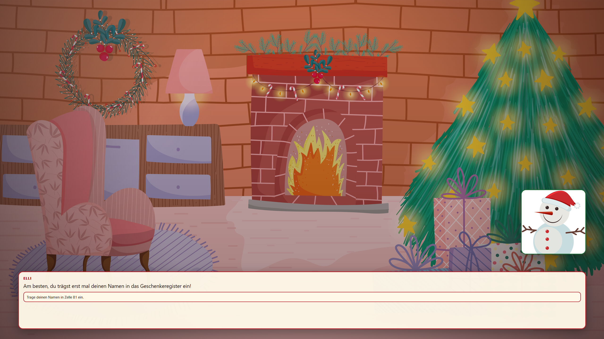
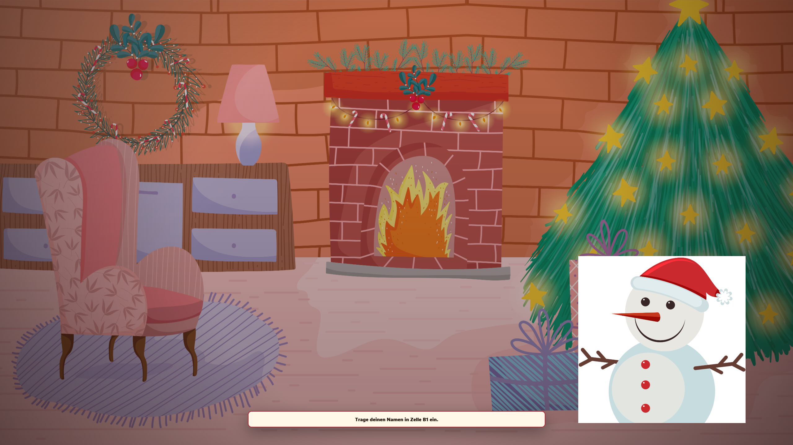
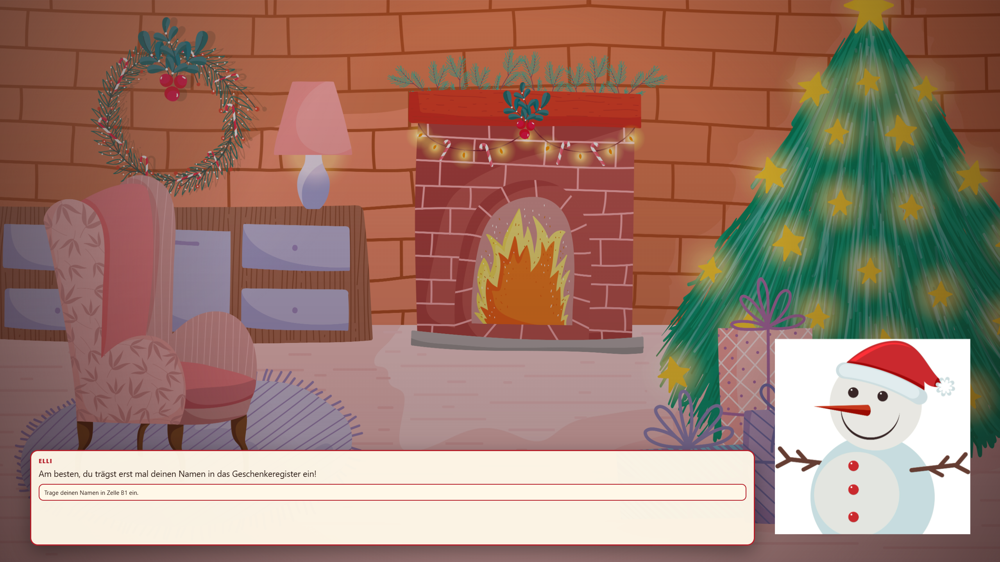
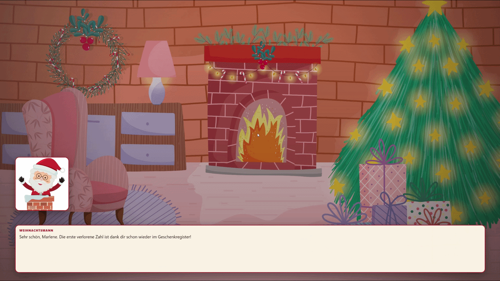

# CScape Story Styles

`js/story-styles` is an extension for CScape projects that displays Reveal/CScape slides as a dialogue-driven story, visual novel, or text adventure.

The extension includes, among other things:

- speaker portraits with fade-in animations
- dialogue boxes and task panels
- multiple layouts for dialogue and characters
- typewriter animation or instant text display
- background music and sound effects
- optional dynamic speech output through the Web Speech API
- configurable themes through CSS custom properties
- integration with existing `data-cscape-check` slides

---

## Repository Structure

```text
js/story-styles/
├── README.md
├── cscape-story.css
├── cscape-story.js
└── img/
```

---

# Installing Story Styles in a CScape Project

A typical CScape project already contains an `index.html`, `reveal.js`, and other template files.

The `js/story-styles` directory is already part of this CScape repository.

The project structure looks like this:

```text
my-cscape/
├── index.html
├── game.py
├── revealjs-cscape.js
├── reveal.js/
├── js/
│   └── story-styles/
│       ├── cscape-story.css
│       ├── cscape-story.js
│       └── README.md
├── ...
```

---

# Including Story Styles in `index.html`

## Importing the CSS

Add the Story Styles stylesheet in the `<head>` after the Reveal styles:

```html
<link rel="stylesheet" href="reveal.js/dist/reset.css">
<link rel="stylesheet" href="reveal.js/dist/reveal.css">
<link rel="stylesheet" href="reveal.js/dist/theme/black.css">

<link rel="stylesheet" href="js/story-styles/cscape-story.css">
```

## Importing the JavaScript

Cscape Story is a Reveal.js plugin. Include the script and register it in `Reveal.initialize`:

```html
<script src="reveal.js/dist/reveal.js"></script>
<script src="revealjs-cscape.js"></script>
<script src="js/story-styles/cscape-story.js"></script>

<script>
    document.addEventListener("DOMContentLoaded", () => {
        Reveal.initialize({
            hash: false,
            controls: false,
            progress: false,
            transition: "none",
            center: false,
            plugins: [
                RevealCscape,
                CscapeStory
            ],
            cscape_story: {
                defaultLayout: "dialogue",
                defaultTextMode: "type",
                typeSpeed: 28,
                blockNavigationUntilReady: true
            }
        });
    });
</script>
```

> **Note:** The plugin initializes automatically when Reveal is ready. No need to call `window.CSCAPE_STORY_API.init()` manually.

---

# Minimal Complete Example

```html
<!doctype html>
<html lang="en">
<head>
    <meta charset="utf-8">
    <meta name="viewport" content="width=device-width, initial-scale=1.0">

    <title>My CScape Adventure</title>

    <link rel="stylesheet" href="reveal.js/dist/reset.css">
    <link rel="stylesheet" href="reveal.js/dist/reveal.css">
    <link rel="stylesheet" href="reveal.js/dist/theme/black.css">
    <link rel="stylesheet" href="js/story-styles/cscape-story.css">
</head>

<body>
<div class="reveal">
    <div class="slides">

        <section
            data-layout="dialogue"
            data-speaker="Ada"
            data-avatar="pics/ada.png"
            data-side="left">
            <div class="cscape-dialogue">Welcome to the escape room!</div>
            <div class="cscape-task">Solve the first task.</div>
        </section>

        <section
            data-layout="dialogue"
            data-cscape-check="check_first_task"
            data-speaker="Ada"
            data-avatar="pics/ada.png"
            data-side="right">
            <div class="cscape-dialogue">Great! The first task is complete.</div>
        </section>

    </div>
</div>

<script src="reveal.js/dist/reveal.js"></script>
<script src="revealjs-cscape.js"></script>
<script src="js/story-styles/cscape-story.js"></script>

<script>
    document.addEventListener("DOMContentLoaded", () => {
        Reveal.initialize({
            hash: false,
            controls: false,
            progress: false,
            transition: "none",
            center: false,
            plugins: [
                RevealCscape,
                CscapeStory
            ],
            cscape_story: {
                blockNavigationUntilReady: true,
                defaultLayout: "dialogue",
                defaultTextMode: "type",
                typeSpeed: 28
            }
        });
    });
</script>
</body>
</html>
```

The Story script automatically creates the required elements for the speaker portrait, dialogue text, and task panel inside `.scene`. You **do not need** to add `<div class="scene">` manually.

Instead of `data-dialogue` and `data-task` attributes, use child elements:

```html
<div class="cscape-dialogue">Dialogue text here</div>
<div class="cscape-task">Task text here</div>
```

These elements are hidden via CSS and serve as data sources for the script, which copies their content into the styled dialogue box and task panel.

---

# Structure of a Story Slide

A Story slide is a regular Reveal `section` element with `data-*` attributes and child elements for content:

```html
<section
    data-layout="dialogue"
    data-speaker="Elli"
    data-avatar="pics/elli.jpg"
    data-side="right">
    <div class="cscape-dialogue">A number is still missing from the table.</div>
    <div class="cscape-task">Calculate the missing value.</div>
</section>
```

## Basic Attributes

| Attribute | Description |
|---|---|
| `data-layout` | Slide layout: `dialogue`, `video`, `hybrid`, `none`, or `black` |
| `data-speaker` | Name of the speaking character |
| `data-avatar` | Path to the character image |
| `data-side` | Character side: `left` or `right` |
| `data-background` | Custom background image for the slide |
| `data-bg` | Short form of `data-background` |
| `data-text-mode` | Text display mode: `type`, `instant`, or `none` |
| `data-cscape-check` | Existing CScape check function used to unlock the slide |

> **Note:** Dialogue and task content is now specified via child elements `<div class="cscape-dialogue">` and `<div class="cscape-task">` instead of `data-dialogue` and `data-task` attributes.

Empty values are allowed for attributes. If no speaker image is provided, the script hides the corresponding area.

---

# Layouts

## `dialogue`

Classic visual-novel layout:

- square speaker portrait
- dialogue box at the bottom
- task displayed inside the dialogue box



```html
<section 
    data-layout="dialogue"
    data-speaker="Elli"
    data-avatar="pics/elli.jpg"
    data-side="right">
    <div class="cscape-dialogue">Am besten, du trägst erst mal deinen Namen in das Geschenkeregister ein!</div>
    <div class="cscape-task">Trage deinen Namen in Zelle B1 ein.</div>
</section>
```

## `video`

Large cut-out character without a dialogue box, the appearance is more video-like. The task is displayed separately at the bottom.



```html
<section data-layout="video"
    data-speaker="Elli"
    data-avatar="pics/elli.jpg"
    data-side="right">
    <div class="cscape-dialogue">Am besten, du trägst erst mal deinen Namen in das Geschenkeregister ein!</div>
    <div class="cscape-task">Trage deinen Namen in Zelle B1 ein.</div>
</section>
```

Transparent PNG files are particularly suitable for this layout.

## `hybrid`

A large character like in the video layout, combined with a dialogue box.



```html
<section data-layout="hybrid"
    data-speaker="Elli"
    data-avatar="pics/elli.jpg"
    data-side="right">
    <div class="cscape-dialogue">Am besten, du trägst erst mal deinen Namen in das Geschenkeregister ein!</div>
    <div class="cscape-task">Trage deinen Namen in Zelle B1 ein.</div>
</section>
```

## `none`

Completely hides the speaker, dialogue box, and task panel.

```html
<section
    data-layout="none"
    <!--...-->  
</section>
```

## `black`

Simple black background without any story elements (speaker, dialogue box, task panel). Useful for the beginning of the escape room (first slide).

```html
<section data-layout="black"></section>
```

---

# Text Display

## Typewriter Animation

By default, text is displayed one character at a time:



```html
<section data-text-mode="type">
    <div class="cscape-dialogue">This text is being typed.</div>
</section>
```

## Instant Display

```html
<section data-text-mode="instant">
    <div class="cscape-dialogue">This text appears immediately.</div>
</section>
```

## Hiding Text

```html
<section data-text-mode="none" data-avatar="pics/character.png">
</section>
```

The following shorthand attributes are also supported:

```html
data-text-instant
```

and:

```html
data-no-text
```

## Basic Text Formatting

Two simple markers are supported in dialogue text:

```text
**bold text**
|highlighted objective
```

Example:

```html
<div class="cscape-dialogue">Open **File A**.\n|Objective: Find the password.</div>
```

> **Note:** Line breaks (`\n`) inside the element text are rendered as line breaks.

---

# Global Configuration

Configuration is passed directly in `Reveal.initialize` under the `cscape_story` key:

```javascript
Reveal.initialize({
    plugins: [RevealCscape, CscapeStory],
    cscape_story: {
        blockNavigationUntilReady: true,

        defaultLayout: "dialogue",
        defaultBackground: "pics/background.jpg",
        defaultTextMode: "type",
        typeSpeed: 24,

        defaultMusic: "sounds/background.mp3",
        musicVolume: 0.24,
        musicLoop: true,
        soundVolume: 0.82,

        audioHintText: "Click for music & sounds",

        defaultVoice: "",
        defaultTtsLang: "",
        defaultTtsRate: 1.0,
        defaultTtsPitch: 1.0
    }
});
```

## Configuration Options

| Option | Default | Description |
|---|---:|---|
| `defaultLayout` | `"dialogue"` | Default layout |
| `defaultBackground` | `""` | Global background image |
| `defaultMusic` | `""` | Global background music |
| `musicVolume` | `0.3` | Music volume from `0` to `1` |
| `musicLoop` | `true` | Repeat the music |
| `soundVolume` | `0.85` | Default volume for sounds |
| `typeSpeed` | `28` | Typewriter animation speed in milliseconds |
| `defaultTextMode` | `"type"` | `type`, `instant`, or `none` |
| `audioHintText` | `"Klick für Musik & Sounds"` | Text displayed by the audio unlock hint |
| `defaultVoice` | `""` | Default voice for Web Speech API |
| `defaultTtsLang` | `""` | Default language for Web Speech API |
| `defaultTtsRate` | `1.0` | Default speaking rate |
| `defaultTtsPitch` | `1.0` | Default pitch |
| `blockNavigationUntilReady` | enabled unless explicitly set to `false` | Block navigation until Story actions have finished |
| `beforeSlide` | `null` | Hook executed before processing a slide |
| `afterSlide` | `null` | Hook executed after processing a slide |
| `formatText` | unchanged | Function for dynamically formatting text |

---

# Dynamic Text Values

> **Note:** Use `data-cscape-get` for dynamic text values from the Game Data Store.

Example:

```html
<div class="cscape-dialogue">Hello <span data-cscape-get="name"></span>!</div>
```

---

# Background Images and Themes

## Global Background Image

In the CSS:

```css
body.my-theme {
    --scene-bg-url: url("../pics/background.jpg");
}
```

In the HTML:

```html
<body class="my-theme">
```

## Background Per Slide

```html
<section data-background="pics/snow.jpg">
    <div class="cscape-dialogue">The environment has changed.</div>
</section>
```

## Custom Theme

The appearance can be customized with CSS custom properties:

```html
<style>
    body.theme-example {
        --page-bg: #08111f;
        --font-main: system-ui, sans-serif;
        --font-display: Georgia, serif;

        --scene-bg-url: url("../pics/background.jpg");
        --scene-overlay:
            linear-gradient(
                rgba(5, 15, 30, 0.2),
                rgba(5, 15, 30, 0.55)
            );
        --scene-vignette:
            radial-gradient(
                circle at center,
                transparent 45%,
                rgba(0, 0, 0, 0.62)
            );

        --speaker-border: #69b7ff;
        --speaker-border-right: #c68cff;
        --speaker-radius: 18px;

        --dialogue-bg: rgba(4, 10, 20, 0.9);
        --dialogue-border: #69b7ff;
        --dialogue-radius: 18px;

        --name-color: #69b7ff;
        --text-color: #f4f8ff;
        --objective-color: #8ee6b0;

        --task-bg: rgba(255, 255, 255, 0.1);
        --task-border: rgba(255, 255, 255, 0.3);
        --task-color: #f4f8ff;
    }
</style>
```

Then apply the theme class:

```html
<body class="theme-example">
```

## Important CSS Variables

### General

| Variable | Description |
|---|---|
| `--page-bg` | Page background color |
| `--font-main` | Default font |
| `--font-display` | Font used for names and dialogue |
| `--scene-bg-url` | Default scene background |
| `--scene-overlay` | Overlay above the background |
| `--scene-vignette` | Darkening around the edges |
| `--scene-scanlines` | Optional scanline pattern |
| `--scene-scanlines-opacity` | Scanline opacity |

### Speaker Portrait

| Variable | Description |
|---|---|
| `--speaker-x` | Distance from the left or right edge |
| `--speaker-bottom` | Distance from the bottom |
| `--speaker-width` | Width of the speaker portrait |
| `--speaker-bg` | Background of the portrait frame |
| `--speaker-border` | Left-side border color |
| `--speaker-border-right` | Right-side border color |
| `--speaker-radius` | Border radius |
| `--speaker-shadow` | Shadow |

### Dialogue Box

| Variable | Description |
|---|---|
| `--dialogue-left` | Left offset |
| `--dialogue-right` | Right offset |
| `--dialogue-bottom` | Bottom offset |
| `--dialogue-min-height` | Minimum height |
| `--dialogue-max-height` | Maximum height |
| `--dialogue-bg` | Background |
| `--dialogue-border` | Border |
| `--dialogue-radius` | Border radius |
| `--dialogue-shadow` | Shadow |

### Text and Task

| Variable | Description |
|---|---|
| `--name-color` | Speaker name color |
| `--text-color` | Dialogue text color |
| `--objective-color` | Highlighted objective color |
| `--task-bg` | Task background |
| `--task-border` | Task border |
| `--task-color` | Task text color |
| `--name-size` | Name font size |
| `--text-size` | Dialogue font size |
| `--task-size` | Task font size |

### Video and Hybrid Layouts

| Variable | Description |
|---|---|
| `--video-character-width` | Character width |
| `--video-character-height` | Character height |
| `--video-character-bottom` | Bottom offset |
| `--video-character-side-offset` | Horizontal offset |
| `--video-task-width` | Task panel width |
| `--video-task-bottom` | Task panel bottom offset |
| `--hybrid-character-width` | Character width in the hybrid layout |
| `--hybrid-character-height` | Character height in the hybrid layout |

---

# Audio in the Browser

Modern browsers usually allow automatic audio playback only after a user interaction.

Story Styles therefore displays a clickable audio hint. After the first click, music, sounds, and TTS are allowed to play.

The text is configured via the plugin:

```javascript
Reveal.initialize({
    plugins: [CscapeStory],
    cscape_story: {
        audioHintText: "Click for music & sounds"
    }
});
```


---

# Background Music

## Global Music

```javascript
Reveal.initialize({
    plugins: [CscapeStory],
    cscape_story: {
        defaultMusic: "sounds/background.mp3",
        musicVolume: 0.25,
        musicLoop: true
    }
});
```

## Music for a Specific Slide

```html
<section
    data-music="sounds/christmas.mp3"
    data-music-volume="0.24"
    data-music-loop="true">
</section>
```

## Stopping Music

```html
<section data-stop-music="true">
</section>
```

Alternatively:

```html
<section data-music="stop">
</section>
```

---

# Sound Effects

A simple sound effect:

```html
<section
    data-audio-1-src="sounds/bells.mp3"
    data-audio-1-phase="before-text"
    data-audio-1-volume="0.8">
</section>
```

Multiple audio cues are numbered:

```html
<section
    data-audio-1-src="sounds/door.mp3"
    data-audio-1-phase="before-text"

    data-audio-2-src="sounds/success.mp3"
    data-audio-2-phase="after-text">
</section>
```

## Audio Phases

| Phase | Timing |
|---|---|
| `before-text` | Before the text is displayed |
| `start` | At the beginning of the slide |
| `after-text` | After the text has been displayed |

## General Audio Attributes

For a cue with index `1`:

| Attribute | Description |
|---|---|
| `data-audio-1-src` | Audio file |
| `data-audio-1-type` | `sound`, `tts`, `loop`, or `stop-loop` |
| `data-audio-1-phase` | `before-text`, `start`, or `after-text` |
| `data-audio-1-volume` | Volume from `0` to `1` |
| `data-audio-1-delay` | Delay in seconds |
| `data-audio-1-blocking` | If `true`, wait for the sound to finish |
| `data-audio-1-parallel` | Start together with other parallel cues |
| `data-audio-1-group` | Group of parallel cues |
| `data-audio-1-loop` | Repeat the sound |
| `data-audio-1-persistent` | Keep the loop active across slide changes |
| `data-audio-1-id` | Loop ID |
| `data-audio-1-stop` | Stop the loop with this ID |

## Parallel Sounds

```html
<section
    data-audio-1-src="sounds/rain.mp3"
    data-audio-1-phase="start"
    data-audio-1-parallel="true"
    data-audio-1-group="ambience"

    data-audio-2-src="sounds/thunder.mp3"
    data-audio-2-phase="start"
    data-audio-2-parallel="true"
    data-audio-2-group="ambience">
</section>
```

## Starting a Persistent Loop

```html
<section
    data-audio-1-type="loop"
    data-audio-1-src="sounds/machine.mp3"
    data-audio-1-id="machine"
    data-audio-1-persistent="true"
    data-audio-1-volume="0.25">
</section>
```

## Stopping a Persistent Loop

```html
<section
    data-audio-1-type="stop-loop"
    data-audio-1-stop="machine">
</section>
```

---

# Dynamic Speech Output with Web Speech API

Speech output is provided through the browser's Web Speech API. Press **T** to open the voice selection dialog where you can preview and select voices.

## Using TTS on Slides

To enable speech output on a slide, use the following attributes:

```html
<section
    data-speaker="Elli"
    data-generate-sound="true"
    data-tts-text-from="dialogue"
    data-tts-lang="de-DE">
    <div class="cscape-dialogue">Welcome to the escape room.</div>
</section>
```

## TTS Attributes

| Attribute | Description |
|---|---|
| `data-generate-sound="true"` | Enables TTS for this slide |
| `data-tts-text` | Explicit speech text |
| `data-tts-text-from="dialogue"` | Use the dialogue text |
| `data-tts-text-from="task"` | Use the task text |
| `data-tts-voice` | Voice name (optional) |
| `data-tts-lang` | Language code (optional, e.g. "de-DE") |
| `data-tts-rate` | Speaking rate (optional, e.g. 1.0) |
| `data-tts-pitch` | Pitch (optional, e.g. 1.0) |

## Voice Selection Dialog

Press **T** to open the voice selection dialog:
- Search and filter available voices
- Click **Play** to preview a voice with a customizable sample sentence
- Click **Copy** to copy the voice name to clipboard for use in slides
- Available voices depend on the browser and operating system

---

# Combining Sounds and Audio

# Automatic Slide Progression

After text and blocking audio have finished, a slide can advance automatically after a delay:

```html
<section data-after-ready-delay="2">
    <div class="cscape-dialogue">The door opens.</div>
</section>
```

The value is specified in seconds.

With:

```javascript
// In cscape_story configuration
cscape_story: {
    blockNavigationUntilReady: true
}
```

navigation attempts made while text or audio actions are still running are queued and executed after those actions have finished.

---

# Using CScape Checks

Story Styles does not replace the existing CScape logic. `data-cscape-check` can still be used directly on a Story slide:

```html
<section
    data-layout="dialogue"
    data-cscape-check="check_password_done"
    data-speaker="Ada"
    data-avatar="pics/ada.png">
    <div class="cscape-dialogue">Correct! The password works.</div>
</section>
```

Unlocking continues to be controlled by `revealjs-cscape.js` and the CScape backend logic.

---

# Public JavaScript API

After the script has loaded, the following object is available:

```javascript
window.CSCAPE_STORY_API
```

## Replaying the Current Slide

```javascript
window.CSCAPE_STORY_API.replayCurrentSlide();
```

## Checking Whether Audio Is Unlocked

```javascript
window.CSCAPE_STORY_API.isAudioUnlocked();
```

## Stopping a Persistent Loop

```javascript
window.CSCAPE_STORY_API.stopPersistentLoop("machine");
```

## Stopping All Persistent Loops

```javascript
window.CSCAPE_STORY_API.stopAllPersistentLoops();
```

> **Note:** Initialization via `window.CSCAPE_STORY_API.init()` is no longer required. The plugin initializes automatically when registered in `Reveal.initialize`.

---

# Complete Integration Snippet

```html
<head>
    <link rel="stylesheet" href="reveal.js/dist/reset.css">
    <link rel="stylesheet" href="reveal.js/dist/reveal.css">
    <link rel="stylesheet" href="reveal.js/dist/theme/black.css">
    <link rel="stylesheet" href="js/story-styles/cscape-story.css">

    <style>
        body.theme-custom {
            --scene-bg-url: url("../pics/background.jpg");
            --speaker-border: #ff9b64;
            --dialogue-border: rgba(255, 255, 255, 0.35);
            --name-color: #ff9b64;
        }
    </style>
</head>

<body class="theme-custom">
<div class="reveal">
    <div class="slides">
        <section
            data-layout="dialogue"
            data-speaker="Ada"
            data-avatar="pics/ada.jpg"
            data-side="left"
            data-music="sounds/background.mp3"
            data-music-volume="0.2"
            data-generate-sound="true"
            data-tts-text-from="dialogue"
            data-tts-lang="de-DE">
            <div class="cscape-dialogue">Welcome to the adventure.</div>
            <div class="cscape-task">Click once to enable audio.</div>
        </section>
    </div>
</div>

<script src="reveal.js/dist/reveal.js"></script>
<script src="revealjs-cscape.js"></script>
<script src="js/story-styles/cscape-story.js"></script>

<script>
    document.addEventListener("DOMContentLoaded", () => {
        Reveal.initialize({
            hash: false,
            controls: false,
            progress: false,
            transition: "none",
            center: false,
            plugins: [
                RevealCscape,
                CscapeStory
            ],
            cscape_story: {
                blockNavigationUntilReady: true,
                defaultVoice: "",
                defaultTtsLang: "",
                defaultTtsRate: 1.0,
                defaultTtsPitch: 1.0,
                defaultMusic: "sounds/background.mp3",
                musicVolume: 0.2,
                soundVolume: 0.8,
                typeSpeed: 24,
                defaultLayout: "dialogue",
                defaultTextMode: "type",
                audioHintText: "Click for music & sounds"
            }
        });
    });
</script>
</body>
```

---

# Example Project

A complete CScape implementation with Story Styles, characters, music, sound effects, TTS, and CScape checks is available here:

## SpreadsheetScape

<https://github.com/melelelele/spreadsheetscape>
